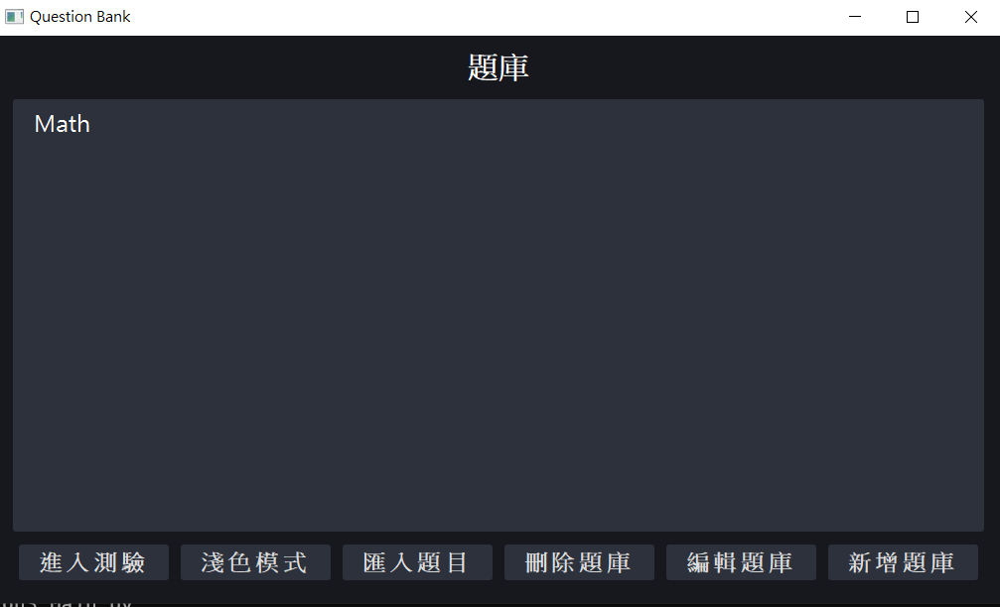
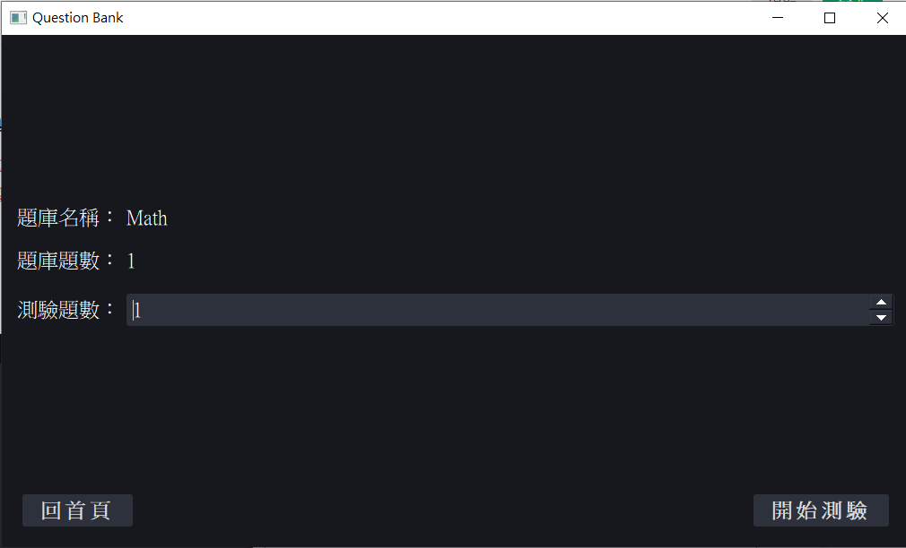

# Intro
This is the final project of OOP Group2. We implement a customized question database

It support:

* add/edit/delete question/question category
* export/import questions
* take exam

See [Project Design and Demo](https://docs.google.com/document/d/1V-3LBofqckehdJZkw5j6bYwpJK5Tj5u4bU7QFUoPiKM/edit?usp=sharing)



# Usage 

**You definitely want to use it under Windows, where packages for QT are may more complete.**

To use this database, please download all files, and make sure they are in the same directory, and run ``Main.py`` 
* It is highly recommended to use python virtual environment, run 
```shell
python -m venv env

# in Windows
call env/Scripts/activate   # now you're in virtual env, do the rest steps 
deactivate                  # exit virtual env

# in Linux 
source env/bin/activate 
deactivate
```
* Install the required packages using `pip install -r requirements.txt`
* the default database storage directory is "./a", to change this directory, you can use option `python Main.py -p [path]`
* the default language is Traditional Chinese, you can change to English version by option `python Main.py -l EN`  
* If you run it in WSL(not recommended), you might get the error message  
``qt.qpa.plugin: Could not load the Qt platform plugin "xcb" in "" even though it was found.``  
In that case, try  
`sudo apt-get install libxcb-icccm4 libfontconfig1 libxcb-glx0 libx11-xcb1 libxcb-image0 libxcb-keysyms1 libxcb-randr0 libxcb-render-util0 libxcb-shape0 libxcb-sync1 libxcb-xfixes0 libxcb-xinerama0 libxcb-xkb1 libxkbcommon-x11-0 libgl1`

To import questions, you can first try export one question bank and see the demand format of question bank

Above supported functions can be executed by clicking the corresponding buttons on the UI.

# File structure
UI/ : QtUI

View/: files for User Interface

Controller/: files for communication between user interface and logical data base (aka model)

Model/: files for physical database implementation, and communication between real data and controller

tests/: our test functions to debug

